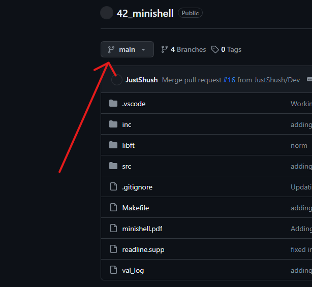
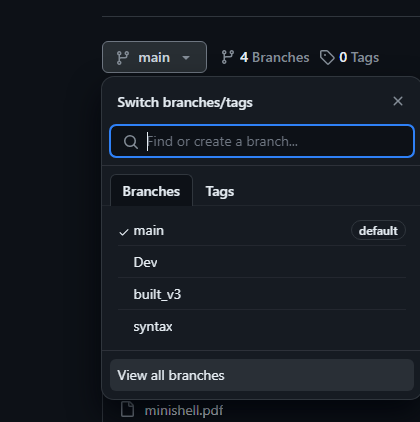
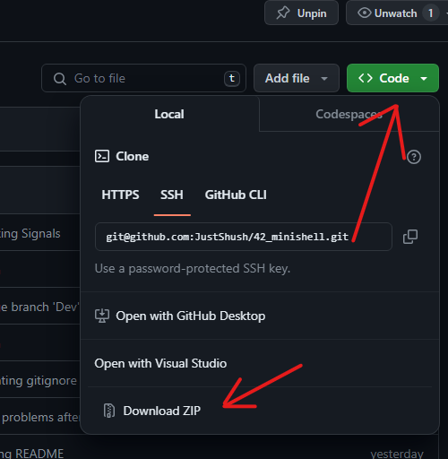

<h1 align="center"> Computação e Representação Gráfica </h1>

 Tudo oque foi feito em CRG no segundo ano e segundo semestre de Engenharia Informatica na <a href="https://www.lis.ulusiada.pt/pt-pt/in%c3%adcio.aspx">Universidade Lusiada de Lisboa</a> de 2024.

  <a href="#sobre">Sobre</a>
  •
  <a href="#agenda">Agenda</a>
  •
  <a href="#objetivos">Objetivos</a>
  •
  <a href="#exercicios">Exercicios</a>

## Sobre

- Aulas dadas e preparadas pela Profª. Inês Furtado

## Agenda

- Conteúdo Programático
- Metodologia da disciplina
- Avaliação
- Bibliografia sugerida
- Introdução à Computação Gráfica

## Objetivos

- Fazer <i>front-end</i> de um website
- Prover uma introdução aos conceitos básicos da computação gráfica
- Apresentar conceitos práticos de aplicações
- Introduzir noções básicas de programação envolvendo aplicações com WebGL
 

  

## Exercicios

<em>Todos os exercicios feitos nesta cadeira vou estar neste repositório.</em>

Como é que isto vai funcionar. Básicamente eu vou criar varias branches divididas por aulas ou temas.

 - Para ver todas as branches basta clicar no retângulo a esquerda que diz <em>main</em> e escolher a branch que procura.

 

 

 

- Depois basta escolher a branch que tem a matéria/aula que procura

 

 

 

- Por fim basta baixar a branch clicando no botão verde ou executando <code>git clone -b "branchname" git@github.com:JustShush/CRG.git</code> 

 

 

Se nao estiver-res a conseguir podes sempre entrar no discord do curso e pedir ajuda.

